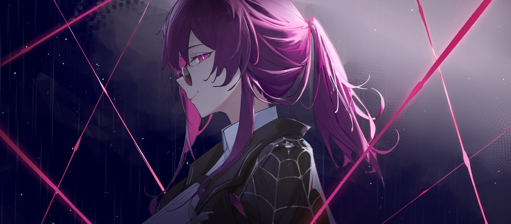
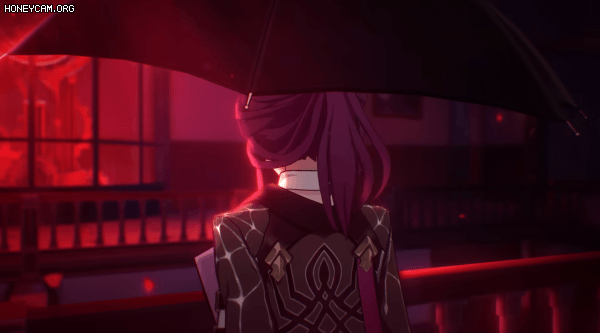

 

# { Amidst }

**Cybersecurity Engineer | Red Team | DevSecOps | Educator**

---

<table>
<tr>
<td width="65%" valign="top">

### About Me

Cybersecurity Engineer with a strong foundation in Red Teaming, Cloud Security, and DevSecOps. Cum Laude Computer Science graduate (3.84/4.00) with 3+ years of experience as an IT Instructor and Assistant Lecturer, teaching Artificial Intelligence, DevOps, and Cybersecurity — including Ethical Hacking, Web Security, and Digital Forensics.

Founder & Ex-Lead of **Nurul Fikri Student Cybersecurity Community**, an independent peer-to-peer learning platform built to bridge the gap between academic theory and real-world security skills. Guided 150+ students through capstone projects and mentored junior students in technical skill development.

My undergraduate thesis on *"Vulnerability Analysis of Web Applications Using the MITRE ATT&CK Framework with Red Team Simulation"* revealed that the most critical vulnerabilities stem from human error — which sparked my research interest in Human-Centric Security and Social Engineering.

Currently pursuing a Master's degree to explore the intersection of human psychology and system security, while actively building red team labs, participating in CTFs, and automating security workflows with n8n and DevOps pipelines.

</td>
<td width="35%" align="center" valign="top">

  

</td>
</tr>
</table>

---

### Certifications

| Certification | Issuer | Status |
|---|---|---|
| CompTIA PenTest+ | CompTIA | Achieved |
| MCRTA — Multi Cloud Red Team Analyst | CyberWarFare Labs | Achieved |
| MCBTA — Multi Cloud Blue Team Analyst | CyberWarFare Labs | Achieved |
| CCSA — Certified Cyber Security Analyst | CyberWarFare Labs | Achieved |
| OSCP | Offensive Security | Pursuing |
| CEH | EC-Council | Pursuing |
| CPTS | HackTheBox | Pursuing |
| CWES | — | Pursuing |

---

### Tech Stack

**Offensive Security**

**Cloud & DevOps**

**Automation & Languages**

---

*"The most critical vulnerabilities aren't in code — they're in people."*

